# Testing

## Table of Contents

- [Manual Testing](#manual-testing)
- [Browsers Tested](#browsers-tested)
- [Devices Tested](#devices-tested)
- [Bugs and Issues Found](#bugs-issues-found)
- [Validators](#validators)

# Manual Testing

## User Stories
| User Story                |     Description                                                                                  | Status |
|----------------------------------|--------------------------------------------------------------------------------------------------|--------|
| View list of posts     | As a site user I want to see a list of posts so that I can select a post to view                                | Pass   |
| Open a post     | As a site user, I want to click on the title of a post so that I can view the full post                                | Pass   |
| Create a draft post     | As a site administrator, I want to create a draft post so that I can come back to it later                                | Pass   |
| View comments     | As a site user/admin, I want to be able to view comments on an individual post so that I can see the comments people have made                                | Pass   |
| Edit or delete a comment     | As a registered user, I want to edit or delete my comment so that I can ensure that the comment is appropriate                                | Pass   |
| Account registration     | As a site user I want to register an account so that I can create a profile and comment on a post                                | Pass   |
| Approve comments     | As a site administrator I want to approve or disapprove a comment so that only approved comments are displayed                                | Pass   |
| Manage blog posts     | As a site administrator I want to create, read, update and delete posts so that I can manage my blog content                                | Pass   |
| About page     | As a site user I want to see an About page so that I can find out more about the person who wrote the blog                                | Pass   |
| Add and edit the About page     | As a site administrator, I can create or edit the About page so that it is visible on the website                                | Pass   |
| Contact form      | As a site user I want to fill in a contact form so that I can send a message to the site owner                             | Pass   |
| Contact form admin      | As a site administrator I want to see the contact forms that have been submitted so that I can respond to the user                             | Pass   |
| Edit profile      | As a registered user I want to edit and update my profile so that I can keep it up to date                             | Pass   |
| Paginated list of posts      | As a site user I want the list of posts to be paginated so that there are not too many posts on one page                             | Pass   |
| Display number of comments on home page      | As a site user I want to see  on the home page how many approved comments each post has had                             | Pass   |

## Features

| Feature                 |Description                                                                                       | Status |
|----------------------------------|--------------------------------------------------------------------------------------------------|--------|
| Links in Navbar     | Ensure all links in the navbar are working correctly                                | Pass   |
| Links on all pages         | Verify that all links on various pages are functional and work correctly                                | Pass   |
| Responsiveness on all screen sizes     | Check the responsiveness of the site on different screen sizes to ensure proper display and functionality                                | Pass   |
| User registration, login and logout     | Test the user registration process to ensure users can create accounts, log in and log out correctly                                | Pass   |
| Commenting on posts     | Ensure that logged-in users can comment on admin's posts                                | Pass   |
| Comment editing functionality     | Ensure users can edit their own comments                                | Pass   |
| Comment deletion functionality     | Ensure users can delete their own comments                                | Pass   |
| Profile editing functionality     | Ensure that users can edit their own profiles                                | Pass   |
| User deletion     | Ensure that admin can delete a user, and all their comments and their profile are deleted                                | Pass   |

# Browsers Tested

This project has been tested on:
- Chrome
- Edge
- Safari

# Devices Tested
This project has been tested on:
- Windows 11
- iPhone 6
- iPad Air (4th generation)

# Bugs and Issues Found

dd

# Validators
## W3C HTML
A few errors were found in the intial check using WC3 validator but these were manually fixed and no further errors were found. All info errors relate to "Trailing slash on void elements".

Home page - 0 warnings, 9 info messages
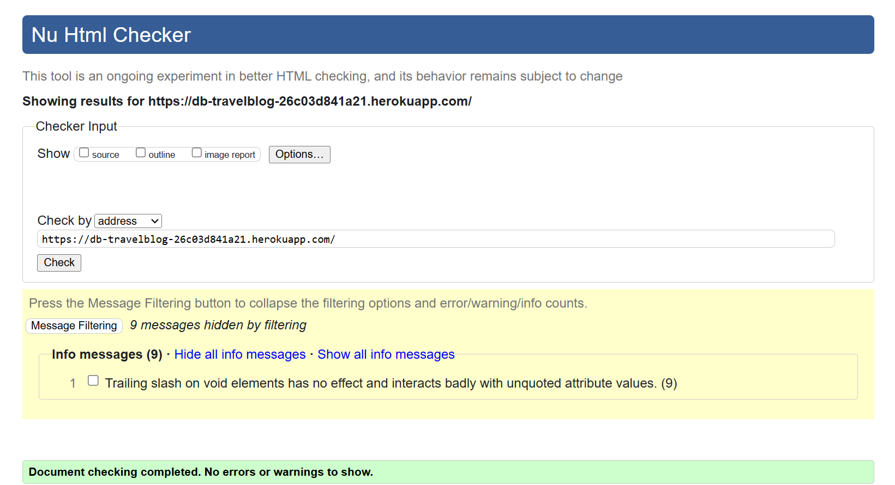

About page - 0 warning, 1 info message
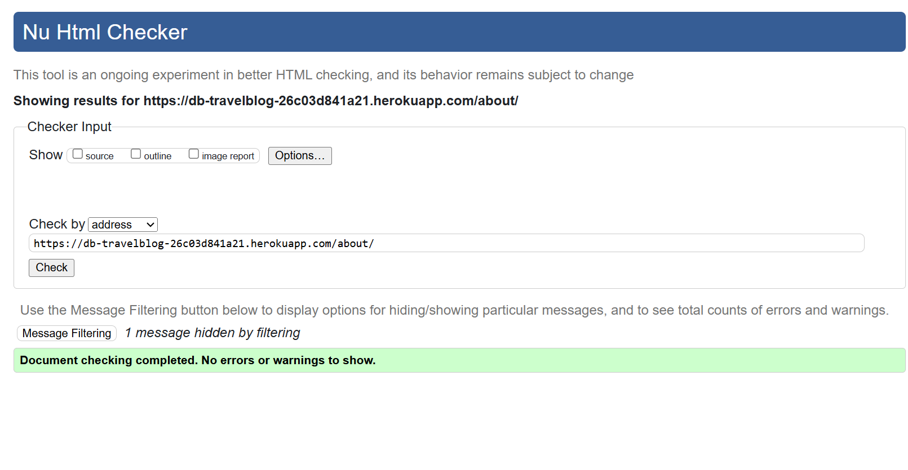

Blog post - 0 warning, 1 info message
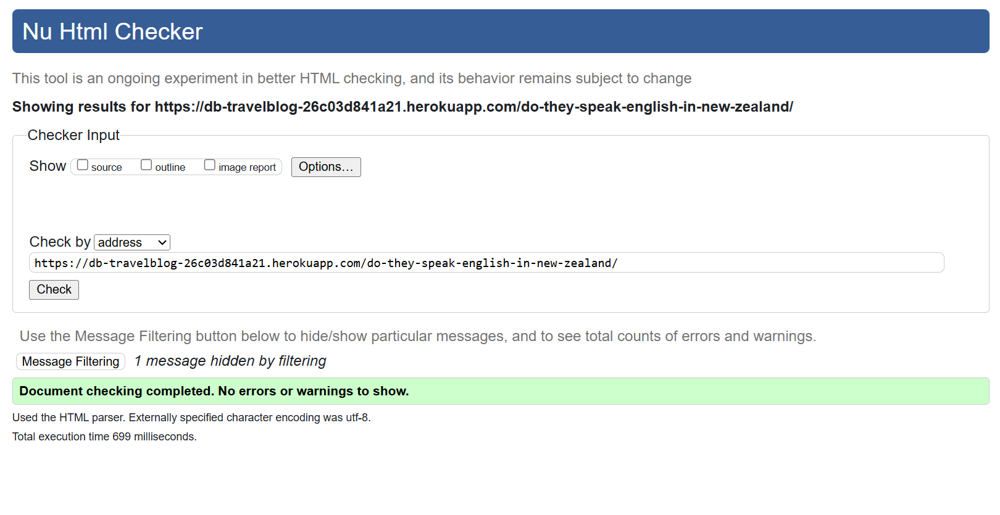

Register page - 0 warning, 1 info message
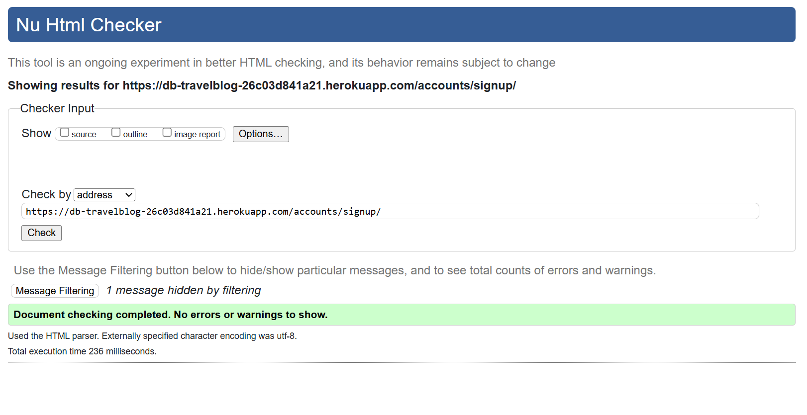

Login page - 0 warning, 1 info message
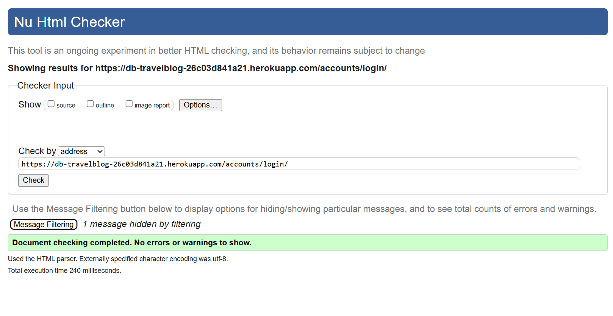

My Profile page
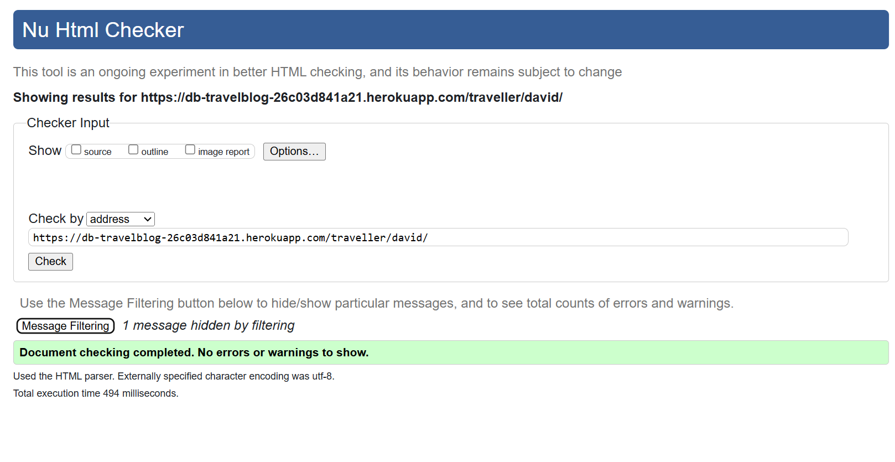

Logout page - 0 warnings, 9 info messages
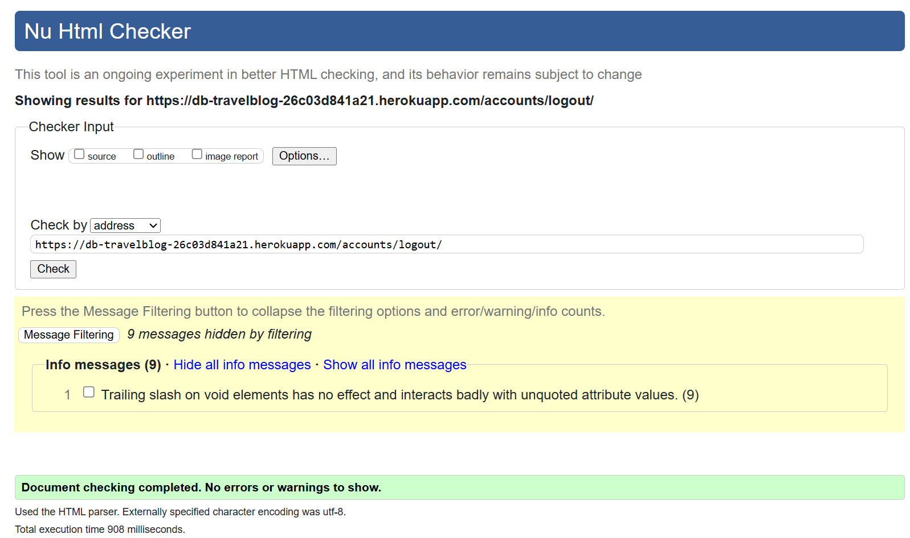

## Jigsaw CSS
No errors were found.
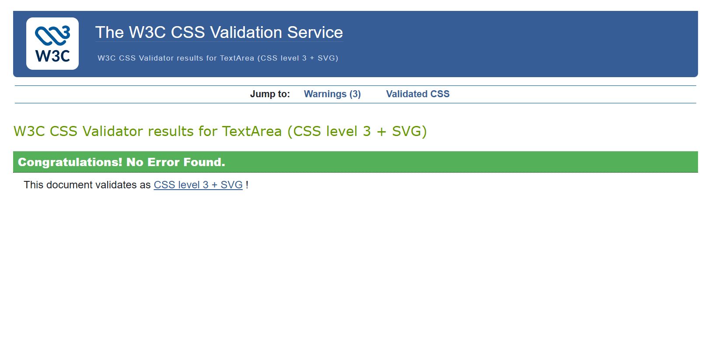

## Code Institute's Python Linter

Some minor issues were found, mainly issues with line brakes and spacing, but these were all fixed.

LIST THE PAGES
settings.py
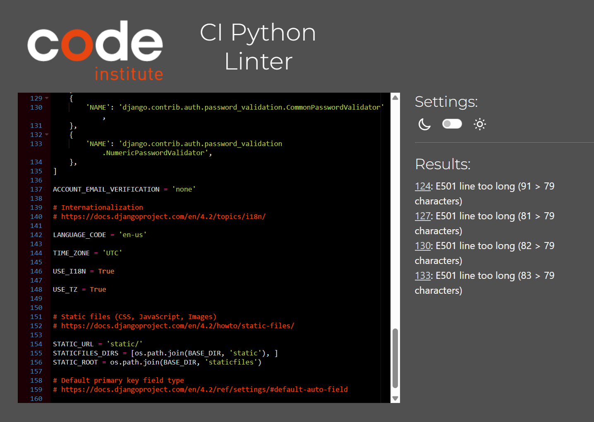

urls.py

blog/admin.py
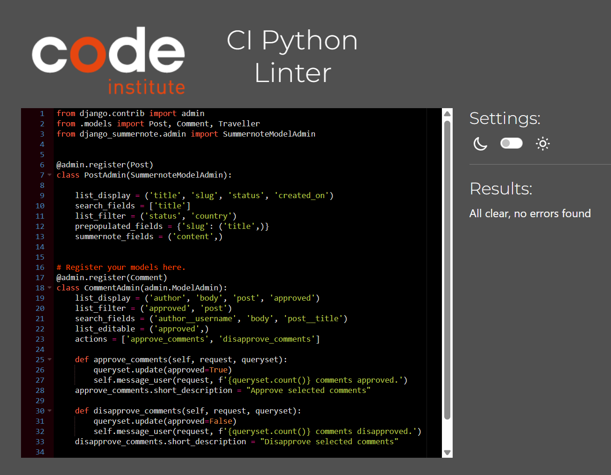

blog/forms.py
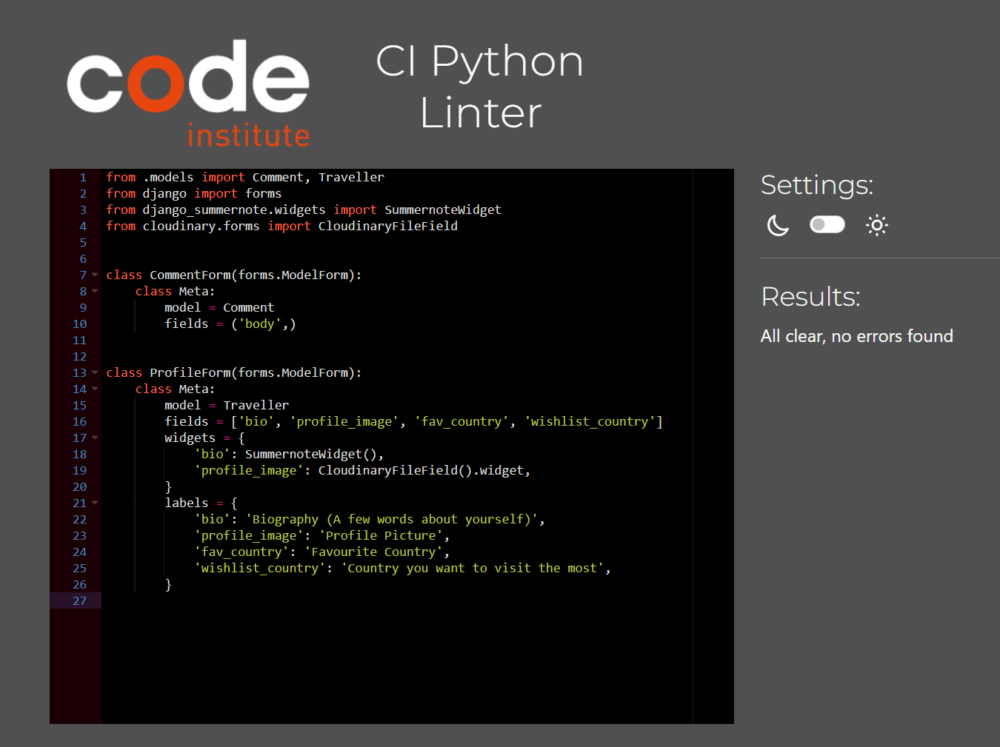

blog/models.py
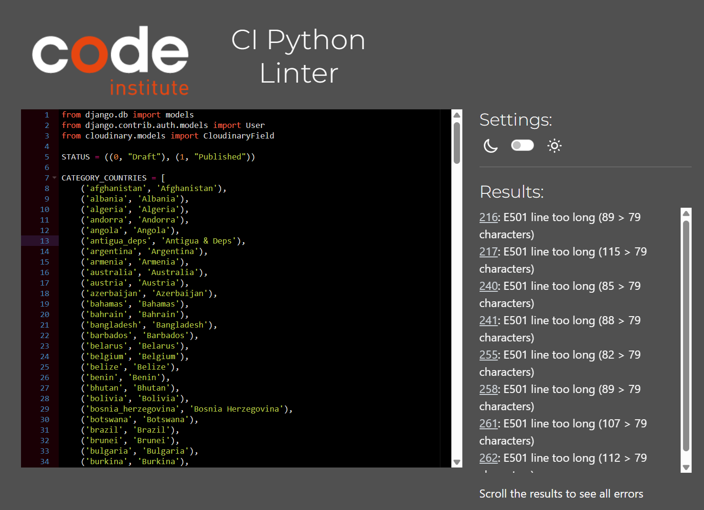

blog/urls.py

blog/views/py
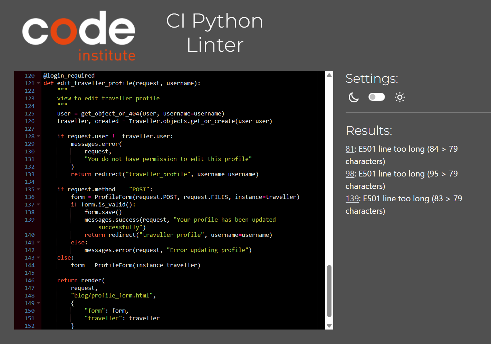

# Lighthouse

## Desktop
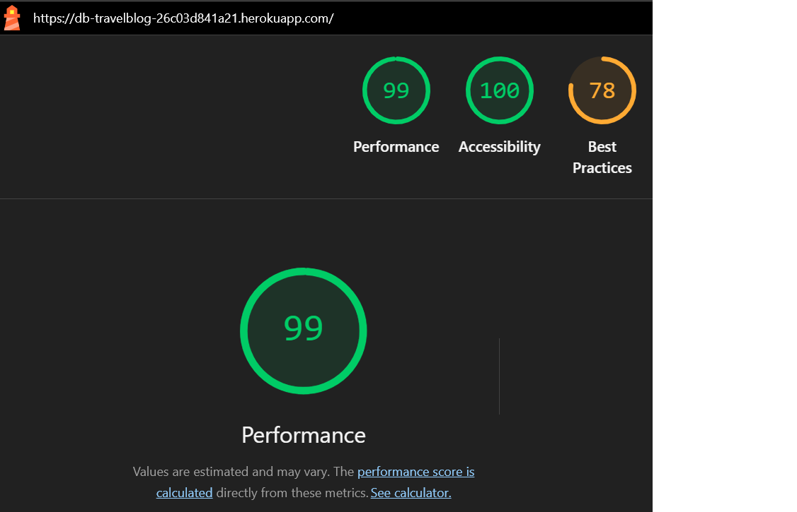

## Mobile
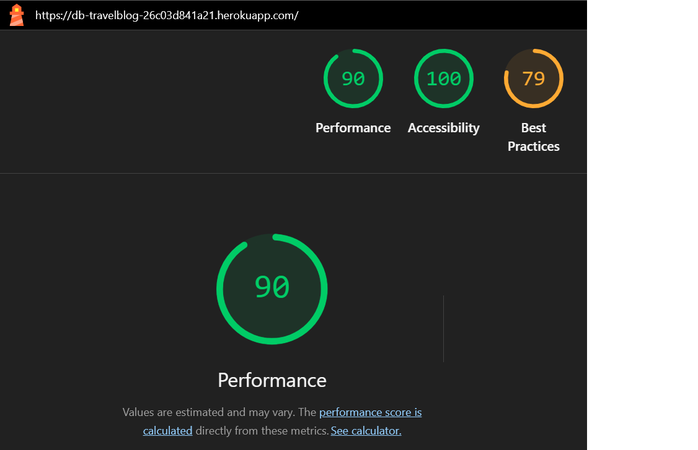